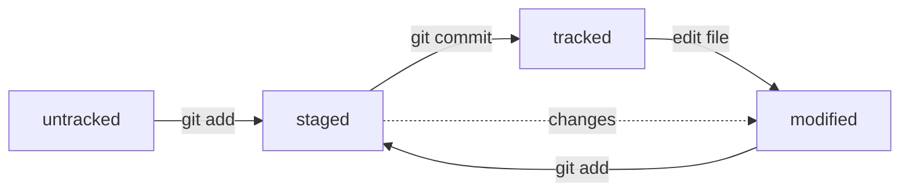

# Всё, что я узнал на данный момент о Git
---
## Команды

### Команды навигации:
- **cd** - переход к указанной директории (cd .. - переход на уровень выше; cd . - переход к текущему уровню; cd /<> - переход по указанному пути)
- **pwd** - отображение текущей директории;
- **ls** - отображение пути к текущей директории.

### Команды работы с файлами а папками:
- **touch** - создать файл;
- **mkdir** - создать папку. Атрибуты -p - создать каталог;
- **mv** - переместить;
- **cp** - копировать;
- **rm** - удалить файл;
- **rmdir** - удалить папку;
- **cat** - отобразить содержимое файла;
- **clip** - копировать файл.

### Команды работы с версиями:
- **git config** - настройка Git;
- **git init** - инициализация репозитория в текущей директории;
- **git status** - статус в текущей директории Git, --ignored - для включения игнорируемых файлов;
- **git reset** - сброс Git в текущей директории, --hard <hash commit>
- **git add** - подготовка файлов к коммиту, --all - добавить все файлы (новые и с изменениями), . - текущая папка и файлы в ней;
- **git commit** - зафисировать изменения;
- **git log** - посмотреть список изменений;
- **git remote** - удалить связь директории с Git сервером;
- **git push** - добавить изменения на удалённый сервер;
- **git log --oneline** - выводит краткий лог коммитов;
- **git commit -m ""** - коментарий, --amend --no-edit - добавь изменения к последнему коммиту и оставь сообщение прежним;
- **git restore --staged <file>**;
- **git diff** - для сравнения modified, --staged - для сравнения staged.

## Статусы файлов в Git:
- **untracked** (англ. «неотслеживаемый»);
- **staged** (англ. «подготовленный»);
- **tracked** (англ. «отслеживаемый»);
- **modified** (англ. «изменённый»).

### Схема mermaid для git status:

## Синхронизация локального и удалённого репозиториев:
- **git remote add origin** <ссылка на удалённый репозиторий>;
- **git remote -v** — проверка связки репозиториев;
- **git push -u origin master** (или main) — первая загрузка коммитов.

## VIM

Выйти из редактора Vim: нажать Esc, ввести :qa!, нажать Enter.

## «Откат» файлов и коммитов:
- **git restore --staged hello.txt** — переводит файл hello.txt из состояния staged обратно в untracked или modified;
- **git restore hello.txt** — вернёт файл к последней версии, которая была сохранена через git commit или git add;
- **git reset --hard b576d89** — удалит все незакоммиченные изменения из staging и «рабочей зоны» вплоть до указанного коммита.

## Просмотр изменений:
- **git diff** (от англ. difference, «отличие», «разница») — покажет изменения в «рабочей зоне», то есть в modified-файлах;
- **git diff a9928ab 11bada1** — выведет разницу между двумя коммитами;
- **git diff --staged** — покажет изменения, которые добавлены в staged-файлах.

## Работа с ветками
- **git branch <>** - создать ветку, -a - отображать все ветки (включая удалённые);
- **git branch** - проверить текущую ветку;
- **git checkout <>** - переключиться на ветку, -b - создать и сразу же переключиться на ветку.
