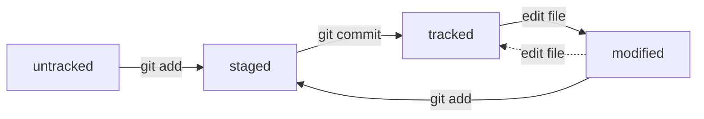

# Всё, что я узнал на данный момент о Git
---
## Команды

### Команды навигации:
- **cd** - переход к указанной директории;
- **pwd** - отображение текущей директории;
- **ls** - отображение пути к текущей директории.

### Команды работы с файлами а папками:
- **touch** - создать файл;
- **mkdir** - создать папку. Атрибуты -p - создать каталог;
- **mv** - переместить;
- **cp** - копировать;
- **rm** - удалить файл;
- **rmdir** - удалить папку;
- **cat** - отобразить содержимое файла;
- **clip** - копировать файл.

### Команды работы с версиями:
- **git config** - настройка Git;
- **git init** - инициализация в текущей директории Git;
- **git status** - статус в текущей директории Git;
- **git reset** - сброс Git в текущей директории$
- **git add** - добавить файлы в Git;
- **git commit** - зафисировать изменения;
- **git log** - посмотреть список изменений;
- **git remote** - удалить связь директории с Git сервером;
- **git push** - отправить фиксацию изменений на Git сервер;
- **git log --oneline** - выводит краткий лог коммитов.

## Статусы файлов в Git:
- **untracked** (англ. «неотслеживаемый»);
- **staged** (англ. «подготовленный»);
- **tracked** (англ. «отслеживаемый»);
- **modified** (англ. «изменённый»).

## Состояния Git status:
- **staged**;
- **modified**;
- **untracked**.

### Схема mermaid для git status:
